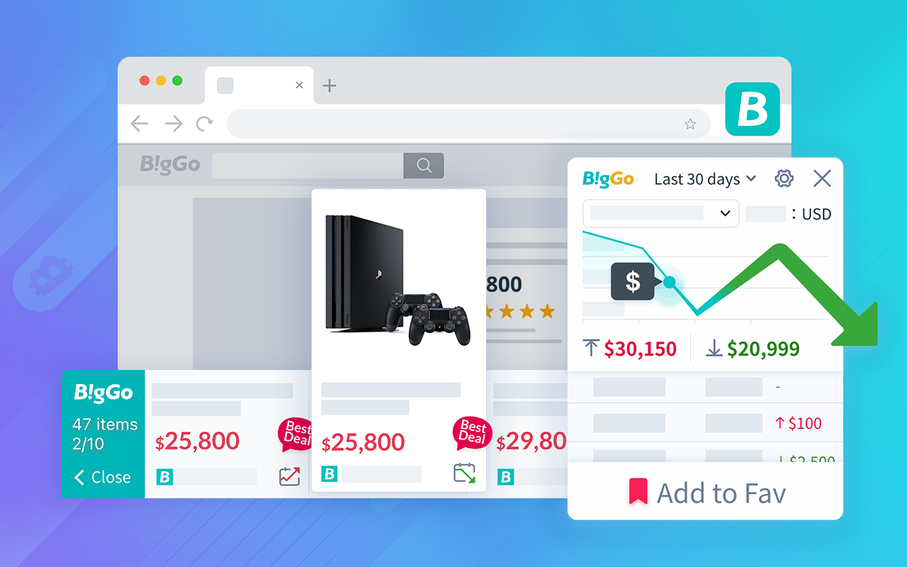
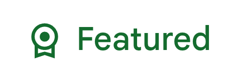
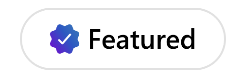
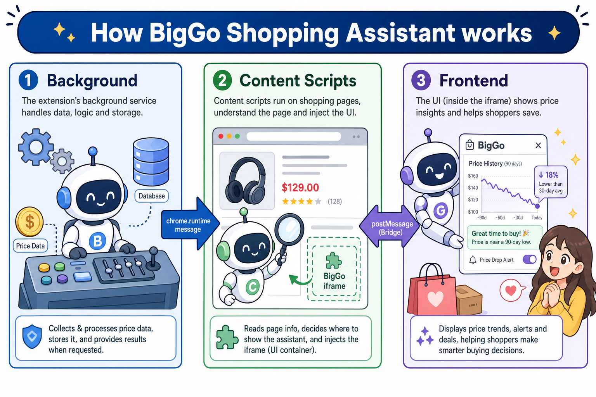
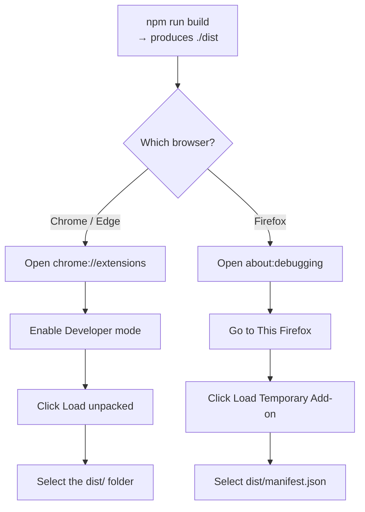

<div align="center">


# BigGo Shopping Assistant

**Automatic price comparison, price history, cashback, and coupons — right where you shop.**

[](./LICENSE)
[](https://chromewebstore.google.com/detail/biggo-shopping-assistant/enlbnppjlpkmjponagpelanookhiejao)
[](https://microsoftedge.microsoft.com/addons/detail/biggo-shopping-assistant/ipjeihekfhfpmohahknkialknlipnnop)
[](https://addons.mozilla.org/firefox/addon/biggo%E6%AF%94%E5%80%8B%E5%A4%A0%E5%B0%8F%E5%B9%AB%E6%89%8B/)
[](https://apps.apple.com/tw/app/id1596059795?mt=12)
[](./CONTRIBUTING.en.md)

[繁體中文](./README.md) | English

</div>

> **BigGo Shopping Assistant** is the browser extension behind [BigGo](https://biggo.com),
> a shopping search engine used across Taiwan, Japan, Southeast Asia, and the Americas.
> It adds price comparison, price history, cashback, and coupons right on the
> e-commerce sites and search results you already use.
>
> This repository is the **open-source upstream** for the extension.

<p align="center">
  
</p>

## Features

- **📉 Price history** — See how a product's price has moved over time, so you know if "on sale" is really a deal, and subscribe to price-drop alerts.
- **💰 Cashback tracking** — Activate and track cashback when you shop at supported stores.
- **🎟️ Coupon recommendations** — Surfaces applicable coupons and promo codes on store pages.
- **🛍️ "More Like This"** — Suggests similar products (and better prices) while you browse.
- **🌏 Multi-region** — Works across many markets with localized store coverage.
- **🏆 Store featured** — A **Featured** extension on both the Chrome Web Store and Microsoft Edge Add-ons.

## Install

| Browser | Link | Badge |
| ------- | ---- | ----- |
| 🌐 Chrome / Chromium | [Chrome Web Store](https://chromewebstore.google.com/detail/biggo-shopping-assistant/enlbnppjlpkmjponagpelanookhiejao) |  |
| 🌐 Edge | [Edge Add-ons](https://microsoftedge.microsoft.com/addons/detail/biggo-shopping-assistant/ipjeihekfhfpmohahknkialknlipnnop) |  |
| 🦊 Firefox | [Firefox Add-ons](https://addons.mozilla.org/firefox/addon/biggo%E6%AF%94%E5%80%8B%E5%A4%A0%E5%B0%8F%E5%B9%AB%E6%89%8B/) | — |
| 🧭 Safari | [Mac App Store](https://apps.apple.com/tw/app/id1596059795?mt=12) | — |

<sub>Featured badges captured from the store listings, July 2026.</sub>

Prefer to build it yourself? See [Build from source](#build-from-source).

## Supported languages

The extension is localized into 15 locales:

`en` · `en_SG` · `es` · `es_419` · `hi` · `id` · `ja` · `ms` · `pt` · `pt_BR` · `th` · `vi` · `zh` · `zh_HK` · `zh_TW`

## How it works

BigGo Shopping Assistant is a cross-browser extension (Chrome MV3, Firefox MV2,
Safari MV2) built with **Vite 6** and **Svelte 5**. It runs in three isolated
execution contexts:



- **Background** (service worker / background page) — state, sync, cashback, icon
- **Content Scripts** (injected into pages) — site detection, iframe injection
- **Frontend** (Svelte app injected into the page) — UI panels

The three contexts talk over two verified channels: `chrome.runtime` messages and `window.postMessage` (Bridge).

Sites are identified by a universal **nindex** key (`{region}_{type}_{name}`),
resolved from a synced site database with a bundled offline fallback.

To dive into the code or contribute, see the [Contributing guide](./CONTRIBUTING.en.md).

## Build from source

Requirements: **Node.js >= 18**, **pnpm >= 8** (recommended) or **npm >= 8**.

```bash
pnpm install           # install dependencies (this repo ships pnpm-lock.yaml for reproducible installs)
# or: npm install      # npm also works, resolving from package.json

npm run build          # production build: Chromium MV3
npm run build:v2       # production build: Firefox MV2
npm run build:safari   # production build: Safari MV2

npm run build:dev      # development one-shot build
npm run watch          # Vite watch mode (Chromium MV3)
```

Every build outputs to `./dist`. To load that unpacked folder:



> **Note:** The open-source build runs without any private credentials. Analytics
> keys are injected at build time and default to a no-op when unset, so a
> self-built extension will not report telemetry.

## Permissions & privacy

The extension requests only what it needs to function:

| Permission | Why |
| ---------- | --- |
| `tabs`, `webNavigation` | Detect the shopping page you're on and react to navigation in single-page-app stores. |
| `cookies` | Read store/session cookies to attribute cashback and continue anonymous analytics IDs. |
| `contextMenus` | Right-click actions (e.g. search selected text on BigGo). |
| `storage`, `alarms` | Cache the synced site database and schedule periodic refreshes. |
| `<all_urls>` | Inject price-comparison and deal panels on supported store pages. |

See the in-extension privacy page for the full privacy policy.

## Build your own shopping assistant

**Taiwan's most popular shopping assistant is now open source.** Build your own
shopping extension on top of BigGo Shopping Assistant — contribute your ideas
back, share them with nearly 300,000 users, and leave your mark on this repository.

> *Given enough eyeballs, all bugs are shallow.*
> — Linus's Law (Eric S. Raymond, *The Cathedral and the Bazaar*)

## Contributing

Contributions are welcome! Please read:

- [Contributing guide](./CONTRIBUTING.en.md) — setup, conventions, PR process
- [Code of Conduct](./CODE_OF_CONDUCT.en.md)
- [Security policy](./SECURITY.en.md) — **do not** file security issues publicly

## License

Licensed under the [Apache License 2.0](./LICENSE).

Copyright 2026 Funmula Corp., Limited.
