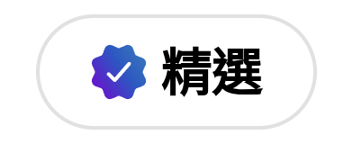
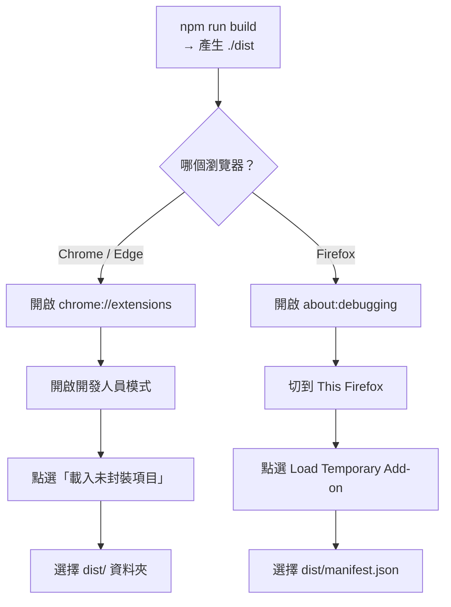

<div align="center">


# BigGo 購物幫手

**自動比價、歷史價格、回饋金與優惠券 — 就在你購物的頁面上。**

[](./LICENSE)
[](https://chromewebstore.google.com/detail/biggo-shopping-assistant/enlbnppjlpkmjponagpelanookhiejao)
[](https://microsoftedge.microsoft.com/addons/detail/biggo-shopping-assistant/ipjeihekfhfpmohahknkialknlipnnop)
[](https://addons.mozilla.org/firefox/addon/biggo%E6%AF%94%E5%80%8B%E5%A4%A0%E5%B0%8F%E5%B9%AB%E6%89%8B/)
[](https://apps.apple.com/tw/app/id1596059795?mt=12)
[](./CONTRIBUTING.md)

繁體中文 | [English](./README.en.md)

</div>

> **BigGo 購物幫手**是購物搜尋引擎 [BigGo](https://biggo.com) 的瀏覽器擴充功能，
> 服務範圍涵蓋台灣、日本、東南亞與美洲。它直接在你已經在用的電商網站與搜尋結果上，
> 為你補上自動比價、歷史價格、回饋金與優惠券功能。
>
> 本 repository 是這個擴充功能的**開源上游（upstream）**。

<p align="center">
  
</p>

## 功能特色

- **📉 歷史價格** — 看清商品價格的變化趨勢，判斷「特價」是不是真的划算，並可訂閱降價通知。
- **💰 回饋金追蹤** — 在支援的店家購物時啟用並追蹤回饋金。
- **🎟️ 優惠券推薦** — 在店家頁面自動帶出可用的優惠券與折扣碼。
- **🛍️ 看相似** — 瀏覽時推薦相似商品（與更低的價格）。
- **🌏 多地區支援** — 支援多個市場，各地區有在地化的店家覆蓋。
- **🏆 商店精選** — Chrome 線上應用程式商店與 Microsoft Edge 外掛程式商店雙雙列為「精選」擴充功能。

## 安裝

| 瀏覽器 | 連結 | 徽章 |
| ------ | ---- | ---- |
| 🌐 Chrome / Chromium | [Chrome Web Store](https://chromewebstore.google.com/detail/biggo-shopping-assistant/enlbnppjlpkmjponagpelanookhiejao) |  |
| 🌐 Edge | [Edge Add-ons](https://microsoftedge.microsoft.com/addons/detail/biggo-shopping-assistant/ipjeihekfhfpmohahknkialknlipnnop) |  |
| 🦊 Firefox | [Firefox Add-ons](https://addons.mozilla.org/firefox/addon/biggo%E6%AF%94%E5%80%8B%E5%A4%A0%E5%B0%8F%E5%B9%AB%E6%89%8B/) | — |
| 🧭 Safari | [Mac App Store](https://apps.apple.com/tw/app/id1596059795?mt=12) | — |

<sub>「精選」徽章擷取自各商店頁面，2026 年 7 月。</sub>

想自己建置？見 [從原始碼建置](#從原始碼建置)。

## 支援語言

擴充功能已在地化為 15 種語系：

`en` · `en_SG` · `es` · `es_419` · `hi` · `id` · `ja` · `ms` · `pt` · `pt_BR` · `th` · `vi` · `zh` · `zh_HK` · `zh_TW`

## 運作原理

BigGo 購物幫手是以 **Vite 6** 與 **Svelte 5** 打造的跨瀏覽器擴充功能
（Chrome MV3、Firefox MV2、Safari MV2），執行於三個彼此隔離的環境：


- **Background**（service worker / background page）— 狀態、同步、回饋金、圖示
- **Content Scripts**（注入各頁面）— 站台偵測、iframe 注入
- **Frontend**（注入頁面的 Svelte app）— UI 面板

三者透過 `chrome.runtime` 訊息與 `window.postMessage`（Bridge）兩層驗證過的通道彼此溝通。

站台以通用識別碼 **nindex**（`{region}_{type}_{name}`）辨識，資料來自同步的站台資料庫，
並內建離線 fallback。

想深入程式碼細節或參與開發，見 [貢獻指南](./CONTRIBUTING.md)。

## 從原始碼建置

需求：**Node.js >= 18**，**pnpm >= 8**（建議）或 **npm >= 8**。

```bash
pnpm install           # 安裝相依套件（本 repo 附 pnpm-lock.yaml，可重現安裝）
# 或 npm install       # npm 亦可，會從 package.json 解析

npm run build          # 正式版建置：Chromium MV3
npm run build:v2       # 正式版建置：Firefox MV2
npm run build:safari   # 正式版建置：Safari MV2

npm run build:dev      # 開發版單次建置
npm run watch          # Vite watch 模式（Chromium MV3）
```

所有建置的輸出都在 `./dist`。載入這個未封裝資料夾的流程：



> **注意：** 開源版建置不需要任何私有憑證。分析金鑰於建置時注入，未設定時預設為
> no-op，因此自行建置的擴充功能不會回報遙測資料。

## 權限與隱私

擴充功能只請求運作所必需的權限：

| 權限 | 用途 |
| ---- | ---- |
| `tabs`、`webNavigation` | 偵測你所在的購物頁面，並因應單頁式（SPA）店家的頁面切換做出反應。 |
| `cookies` | 讀取店家／session cookie 以歸戶回饋金，並延續匿名分析 ID。 |
| `contextMenus` | 右鍵選單動作（例如以選取文字在 BigGo 搜尋）。 |
| `storage`、`alarms` | 快取同步的站台資料庫並排程定期更新。 |
| `<all_urls>` | 在支援的店家頁面注入比價與優惠面板。 |

完整隱私權政策請見擴充功能內的隱私權頁面。

## 打造你自己的購物幫手

**台灣最受歡迎的購物幫手，現在開源了。** 以 BigGo 購物幫手為基礎，打造你專屬的購物擴充套件；
把你的巧思貢獻回來，分享給近三十萬名安裝用戶，在這個 repository 留下你的一筆。

> *Given enough eyeballs, all bugs are shallow.*
> — Linus's Law（Eric S. Raymond,《The Cathedral and the Bazaar》）

## 參與貢獻

歡迎貢獻！請先閱讀：

- [貢獻指南](./CONTRIBUTING.md) — 環境設定、慣例、PR 流程
- [行為準則](./CODE_OF_CONDUCT.md)
- [安全政策](./SECURITY.md) — 安全問題請**勿**公開回報

## 授權

採用 [Apache License 2.0](./LICENSE) 授權。

Copyright 2026 Funmula Corp., Limited.
